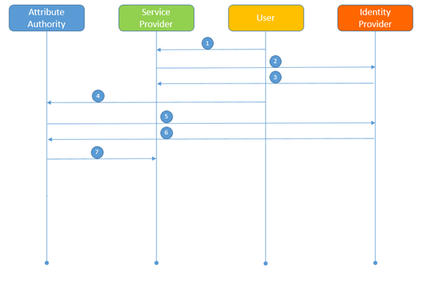

Flusso applicativo che richiede il consenso dell’utente
=======================================================

|image0|

Nel caso di richieste “sincrona” e “asincrona” (cfr. Figura 2):

1. L’utente chiede l’accesso ad un servizio del SP e seleziona l’IDP
   presso il quale ha l’identità digitale.

2. Il SP invia una richiesta di autenticazione presso l’IDP di cui al
   punto 1.

3. L’IDP esegue la procedura di autenticazione e invia la risposta di
   autenticazione al SP.

4. Il SP, avendo bisogno di uno o più attributi qualificati, si avvale
   dell’uso di una AA, informando l’utente secondo quanto previsto dalla
   sulla protezione dei dati personali.

5. L’AA identificata l’utente, ovvero richiede all’utente la prova di
   avvenuta autenticazione dell’utente presso l’IDP.

6. L’AA ottiene prova di avvenuta autenticazione e avvenuto consenso al
   rilascio dei dati presso il SP.

7. L’AA fornisce gli attributi qualificati dell’utente al SP.

Nel processo di autenticazione dell’utente, l’AA può richiedere all’ IDP
l’indirizzo di posta elettronica dell’utente, al fine di inviargli le
seguenti comunicazioni via email:

-  nel caso in cui l’ AA abbia acquisito il consenso di lunga durata,
   dove è disponibile il servizio in rete accessibile tramite SPID per
   gestire (rinnovo o revoca) i consensi di lunga durata;

-  all’ approssimarsi della scadenza del consenso di lunga durata,
   informativa all’ utente dell’ imminente scadenza indicando il
   servizio in rete accessibile tramite SPID per poter eventualmente
   rinnovare il consenso secondo le modalità esposte al §5.3.2.

